# Edge-AI Navigation Assistant on Synaptics Astra SL1680 (VS680 NPU)

A wearable navigation and safety assistant for visually impaired users built on the **Synaptics Astra SL1680 (VS680 NPU)** edge-AI platform. The system fuses **on-device vision (3 INT8 models)**, **ultrasonic ranging**, and an **MPU6050 IMU fall detector** into a single wearable prototype that runs **offline, fully on-device**, and in real time.

> **“Feels like a cane, thinks like an AI camera.”**

---

## Authors
- **Yash Daniel Ingle**
- **Hridya Satish Pisharady**
- **Prateeksha Ranjan**

### Advisors
- Prof. Salma Elmalaki  
- Prof. Quoc-Viet Dang  
- Sauryadeep Pal (Synaptics AI Solutions Engineer)

**University of California, Irvine — MECPS Capstone**

---

## Wearable Prototype (Photo)

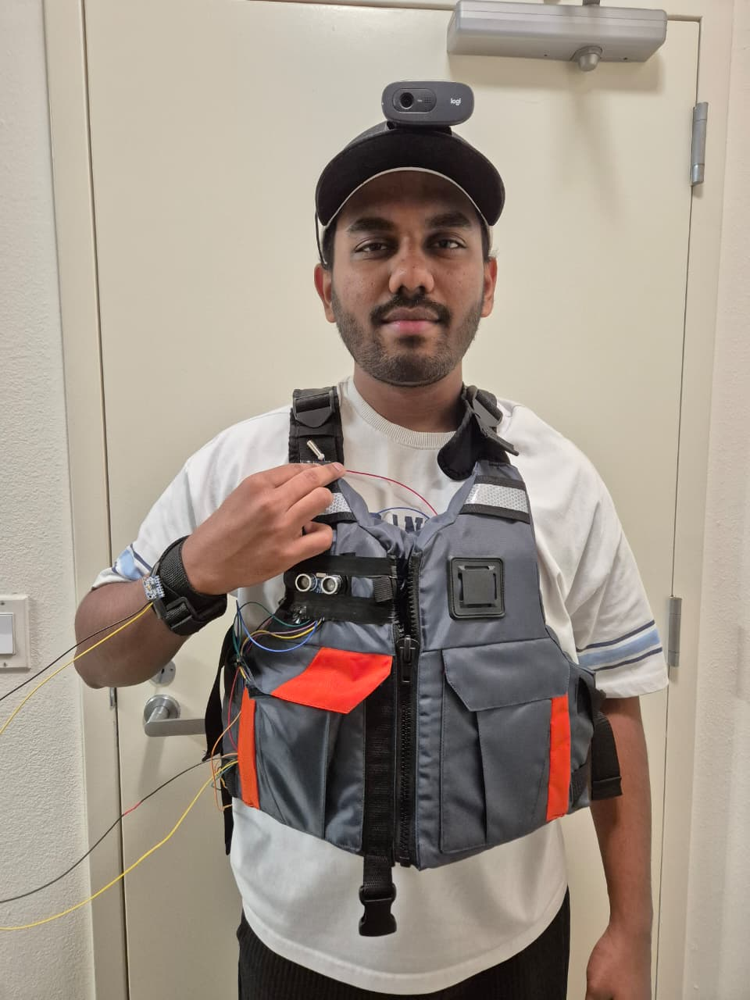

---

## Table of Contents
- [1. Abstract](#1-abstract)
- [2. Motivation](#2-motivation)
- [3. What the System Does](#3-what-the-system-does)
- [4. High-Level System Behavior](#4-high-level-system-behavior)
- [5. System Architecture](#5-system-architecture)
- [6. Finite State Machine](#6-finite-state-machine)
- [7. Hardware](#7-hardware)
  - [7.1 Hardware at a Glance](#71-hardware-at-a-glance)
  - [7.2 Bill of Materials](#72-bill-of-materials)
  - [7.3 GPIO Map (Verified)](#73-gpio-map-verified)
  - [7.4 Build Photos (Integration)](#74-build-photos-integration)
- [8. Software Stack](#8-software-stack)
- [9. Repository Structure](#9-repository-structure)
- [10. Vision Models](#10-vision-models)
  - [10.1 Why 3 Models (Not 1)](#101-why-3-models-not-1)
  - [10.2 Model Responsibilities](#102-model-responsibilities)
  - [10.3 Model Overview (Walk-Sign Branch)](#103-model-overview-walk-sign-branch)
  - [10.4 Datasets & Training Workflow](#104-datasets--training-workflow)
  - [10.5 Conversion: TFLite → .synap (Docker)](#105-conversion-tflite--synap-docker)
  - [10.6 On-Device Vision Runtime Loop (Astra)](#106-on-device-vision-runtime-loop-astra)
- [11. Astra Board Setup + Deployment (Step-by-Step Commands)](#11-astra-board-setup--deployment-step-by-step-commands)
- [12. Sensors & Feedback](#12-sensors--feedback)
- [13. Benchmarking (Raspberry Pi vs Astra NPU)](#13-benchmarking-raspberry-pi-vs-astra-npu)
- [14. Demo](#14-demo)
- [15. Branch Purpose: Walk-Sign](#15-branch-purpose-walk-sign)
- [16. Troubleshooting](#16-troubleshooting)
- [17. Roadmap / Future Work](#17-roadmap--future-work)
- [18. Credits](#18-credits)

---

## 1. Abstract

Visually impaired users commonly rely on a white cane. It is extremely reliable for detecting **ground-level obstacles**, but it provides little to no **semantic context**, such as traffic light states, pedestrian walk signals, dynamic hazards, or mid-level obstacles.

This project augments the cane by adding **scene understanding and safety alerts** using the **Synaptics Astra SL1680 (VS680 NPU)**. All inference and decision-making run **fully on-device**, enabling low latency, offline operation, and privacy.

---

## 2. Motivation

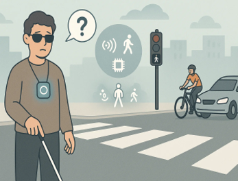

Design goals:
- Offline-first operation
- Low-latency safety cues
- Privacy-preserving on-device vision
- Simple, wearable feedback mechanisms

---

## 3. What the System Does

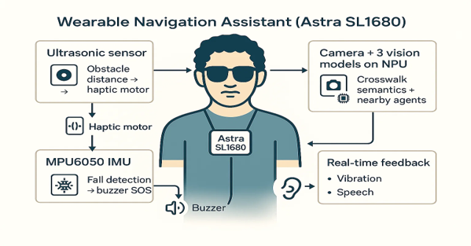

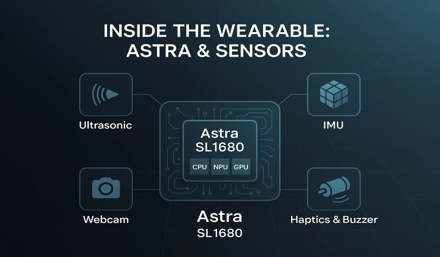

The system:
1. Sees using a head-mounted camera and NPU
2. Senses distance via ultrasonic ranging
3. Detects motion patterns using an IMU
4. Fuses all signals via an FSM and alerts the user

---

## 4. High-Level System Behavior

1. Camera streams frames to Astra
2. Three INT8 vision models run on the VS680 NPU
3. Ultrasonic sensor measures front distance
4. IMU monitors motion patterns
5. FSM fuses all inputs
6. Haptic, buzzer, or audio feedback is triggered
7. SOS SMS is sent on confirmed fall

---

## 5. System Architecture


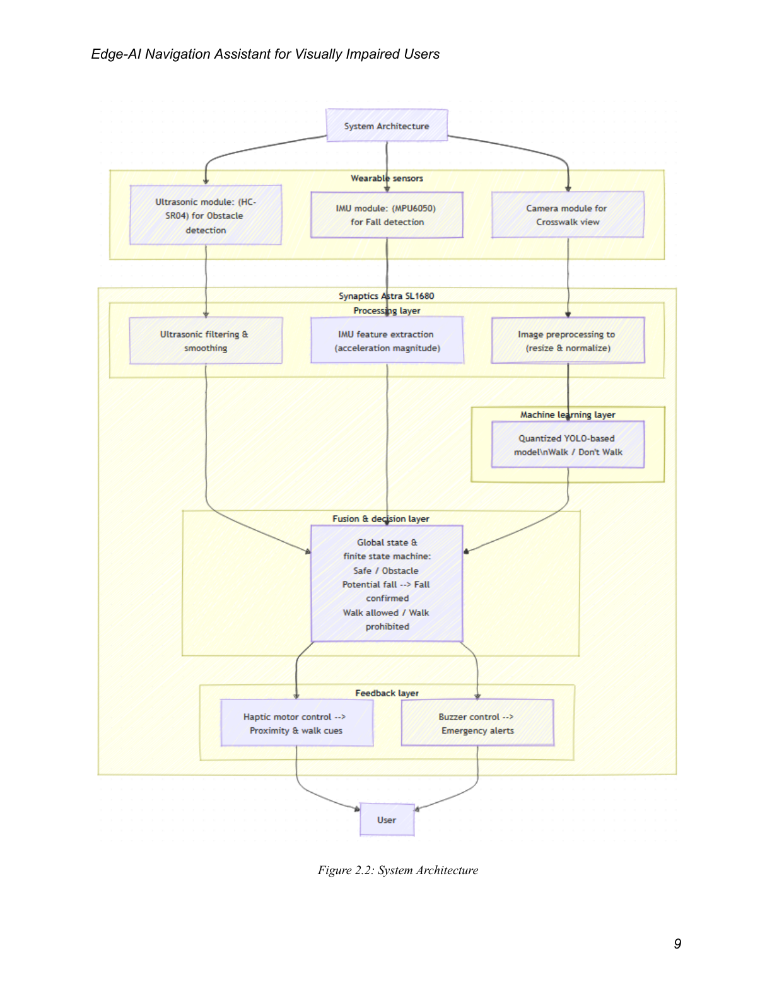

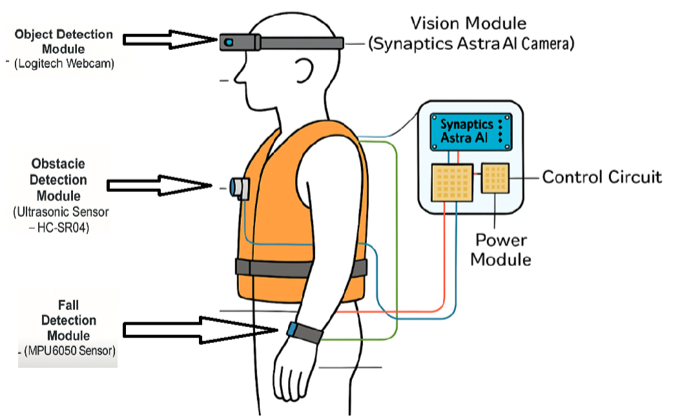

---

## 6. Finite State Machine

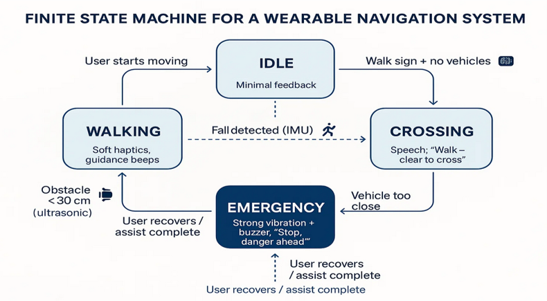

States:
- IDLE / WALKING
- CROSSING
- OBSTACLE
- EMERGENCY

---

## 7. Hardware

### 7.1 Hardware at a Glance

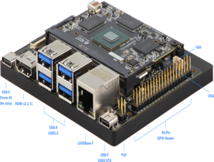

- Synaptics Astra SL1680 (VS680 NPU)
- USB camera
- HC-SR04 ultrasonic sensor
- MPU6050 IMU
- Vibration motor
- Active buzzer
- Battery pack

---

### 7.2 Bill of Materials

| Component | Purpose |
|---|---|
| Astra SL1680 | Edge AI compute |
| USB Camera | Scene capture |
| HC-SR04 | Distance sensing |
| MPU6050 | Fall detection |
| Vibration motor | Haptic feedback |
| Buzzer | Emergency alert |

---

### 7.3 GPIO Map (Verified)

| Function | GPIO |
|---|---:|
| Ultrasonic TRIG | 426 |
| Ultrasonic ECHO | 485 |
| Haptic Motor | 484 |
| Buzzer | 450 |
| Debug LED | 423 |

```bash
cat /sys/kernel/debug/gpio
```

---

### 7.4 Build Photos (Integration)

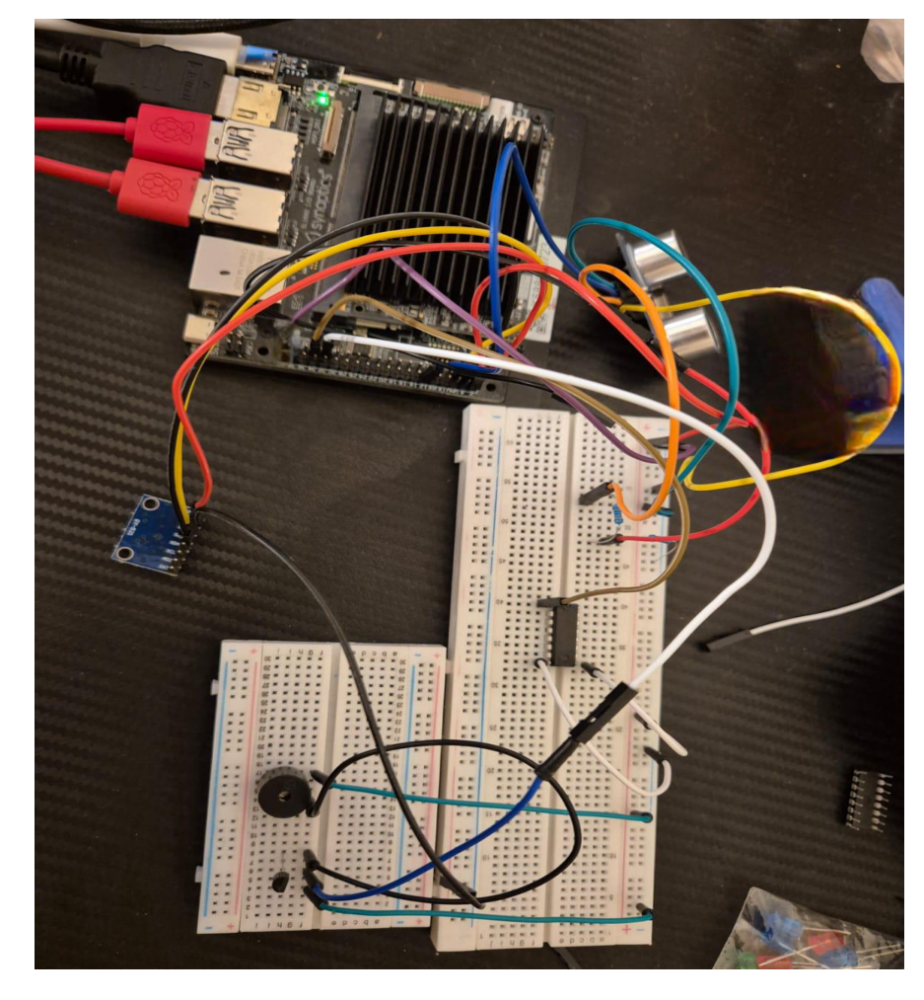

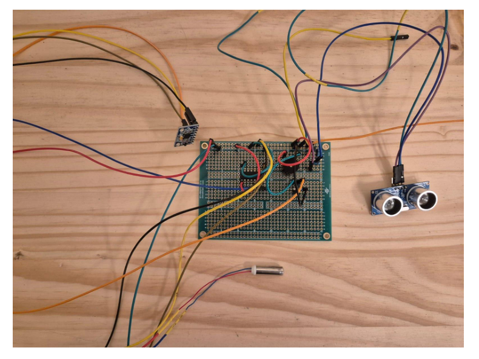

---

## 8. Software Stack

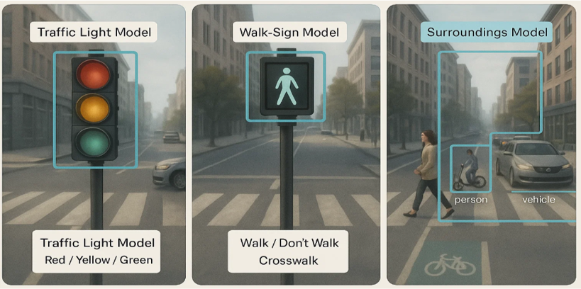

**On-device:** Yocto Linux, SyNAP runtime, Python, OpenCV  
**Development:** Roboflow, YOLOv8, INT8 TFLite, Docker SDK

---

## 9. Repository Structure

```text
wearable-navigation/
├── README.md
├── docs/
├── models/
├── scripts/
├── src/
│   ├── assets/images/
│   ├── vision/
│   ├── sensors/
│   ├── feedback/
│   └── fsm/
└── Walk-Sign/
```

---

## 10. Vision Models

### 10.1 Why 3 Models

Modularity, predictable latency, easier debugging, and stable NPU scheduling.

---

### 10.2 Model Responsibilities

- Traffic Light Model
- Walk-Sign Model
- Surroundings Model

---

### 10.3 Model Overview

Input: 224×224×3 INT8  
Output: Detection head `[1, 11, 1029]`

---

### 10.4 Datasets & Training Workflow

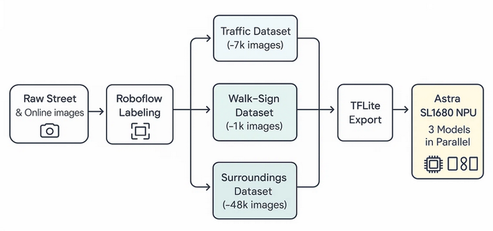

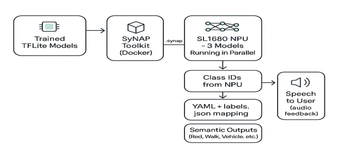

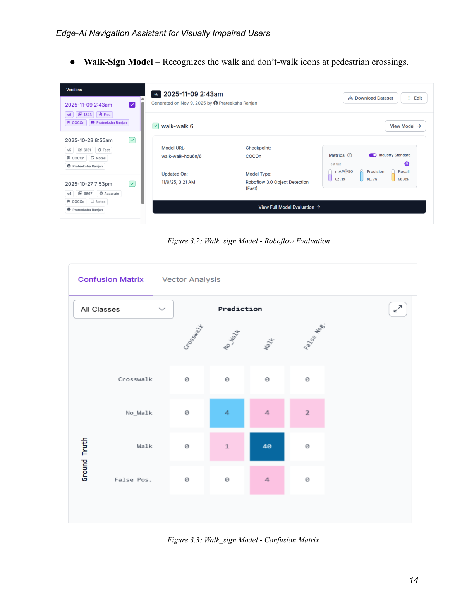

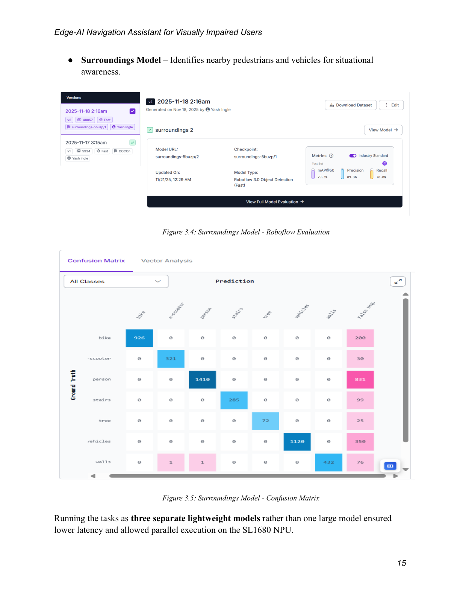

---

### 10.5 Conversion: TFLite → .synap (Docker)

```bash
docker run -it --rm \
  -v D:/Synap:/workspace \
  synapticsas/synap-sdk:1.7 \
  /bin/bash
```

```bash
synap convert \
  --model capstone-synap_v1.tflite \
  --target VS680 \
  --out-dir out/rf_v1
```

---

### 10.6 On-Device Vision Runtime Loop

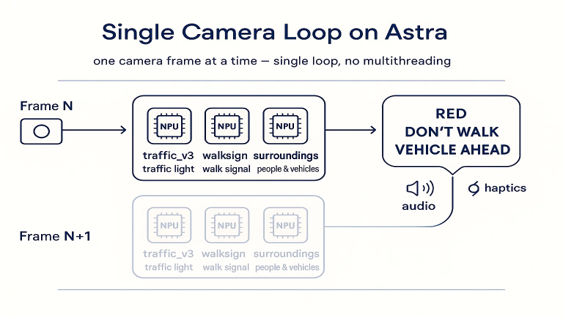

---

## 11. Astra Board Setup + Deployment

```bash
ssh root@<BOARD_IP>
```

---

## 12. Sensors & Feedback

- Ultrasonic → proximity vibration
- IMU → fall detection
- Buzzer + SMS → emergency alert

---

## 13. Benchmarking (Raspberry Pi vs Astra NPU)

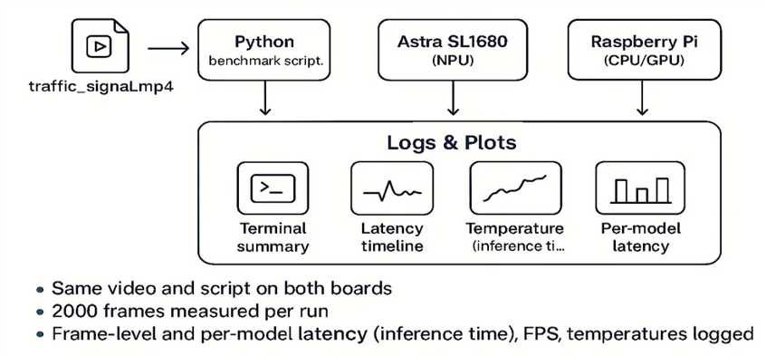

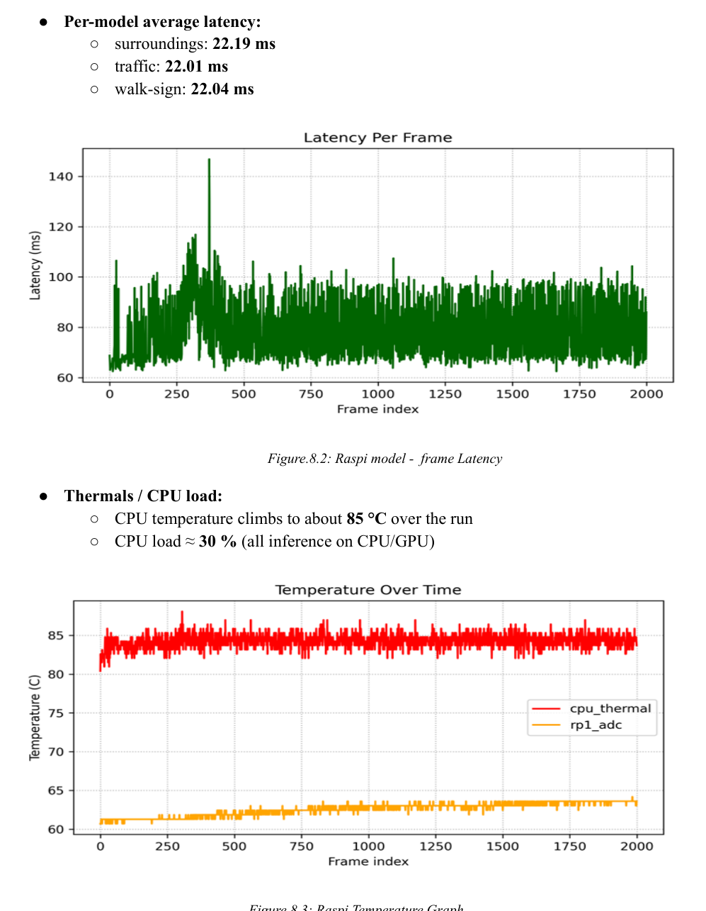

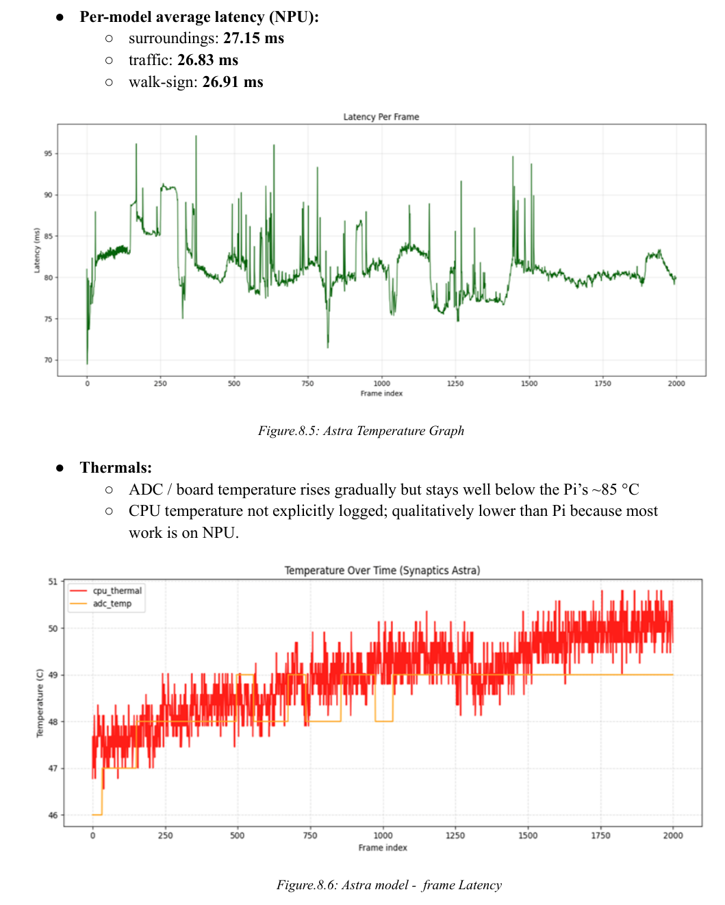

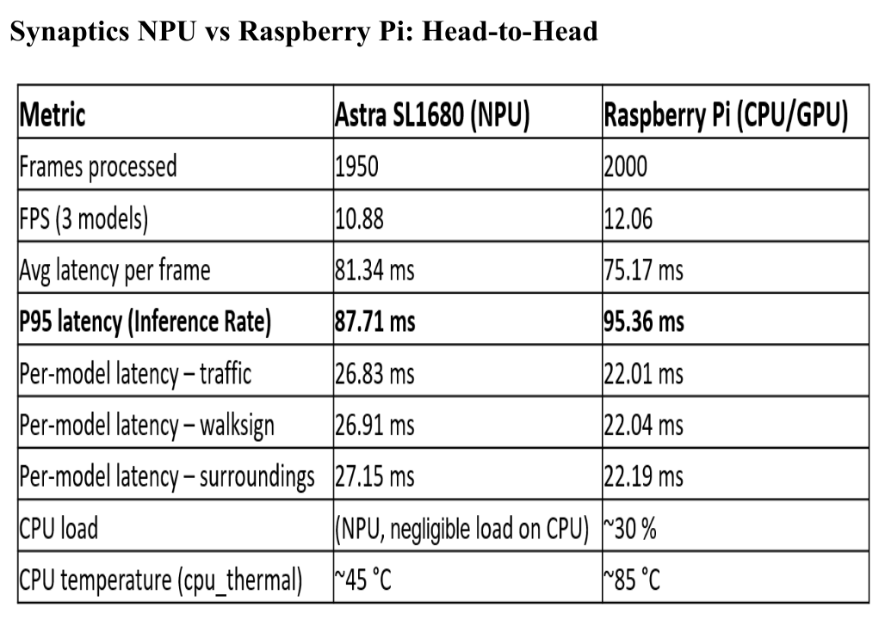

---

## 14. Demo

PASTE_YOUR_DEMO_VIDEO_LINK_HERE

---

## 15. Branch Purpose: Walk-Sign

Contains `.synap` artifacts and conversion references.

---

## 16. Troubleshooting

```bash
ls -l /dev/video*
```

---

## 17. Roadmap / Future Work

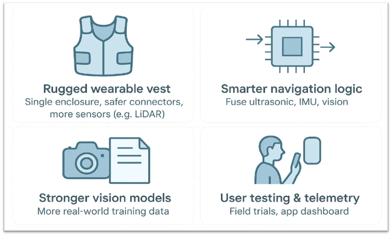

- GStreamer pipeline
- Improved fall detection
- Custom PCB
- Field testing

---

## 18. Credits

**Project Team**
- Prateeksha Ranjan
- Hridya Satish Pisharady
- Yash Daniel Ingle

**University of California, Irvine — MECPS Capstone**

